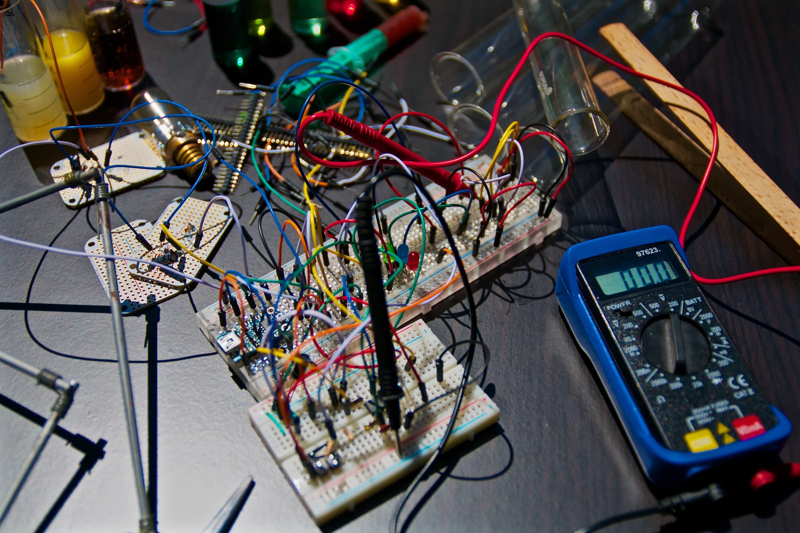
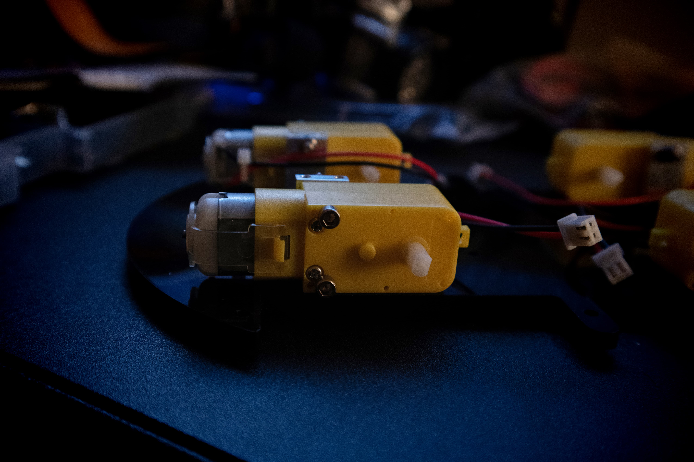
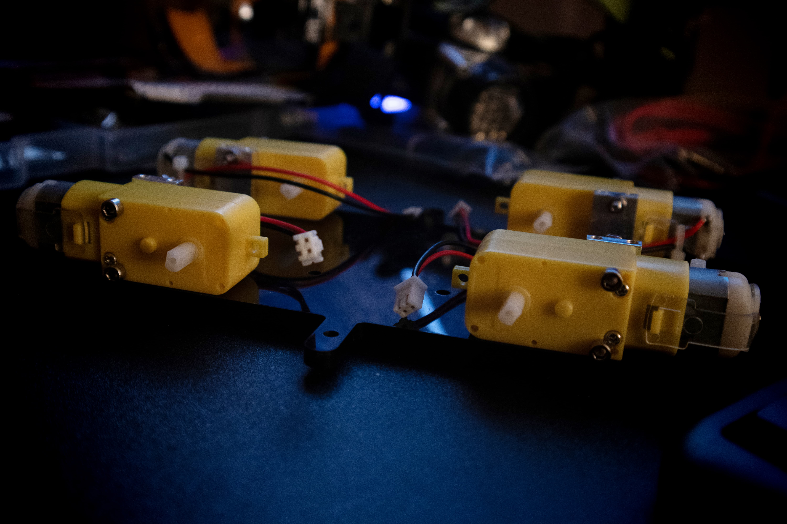

I spent the better half of an evening two Saturdays ago building out the chassis to the [ELEGOO UNO Project Smart Robot Car Kit v 3.0](https://www.amazon.com/dp/B07KPZ8RSZ/ref=cm_sw_r_oth_tai_FLwaDb9WB5SAW
https://www.amazon.com/dp/B07KPZ8RSZ/ref=cm_sw_r_oth_tai_FLwaDb9WB5SAW), which is a thing for teens but that never stopped me before...

`vimeo: https://vimeo.com/118192159`

## Not paying attention to detail and instructions? No bueno

I have a whole playlist saved on my iPad on how to build this thing.

I had this notion like, "I don't need help putting these motors on! I see how to do it!"

I proceeded to put the motors on while jamming to some Abstract Radio on Beats 1[^1]. It was a Golden Age of Bad Boy playlist so *extra bouncy*. I started to put the motors on but...they...didn't quite *look* right.

I watched bits and pieces of the video again and again I went and tried to place these motors on only to do it *the same way*, *four times in a row*. If that ain't stubbornness I don't know what is.

## Twitchy legs and less music

I decided to turn the music down, watch the *whole video* for once and *then* put the motors on. It finally *clicked* and I was left with this, the underside of the chassis.

*Gratuitous lab shot*

*Bottom of the chassis*

*Finishing up*

[^1]: Pretty sure I am the only person listening to Beats 1 anymore.
