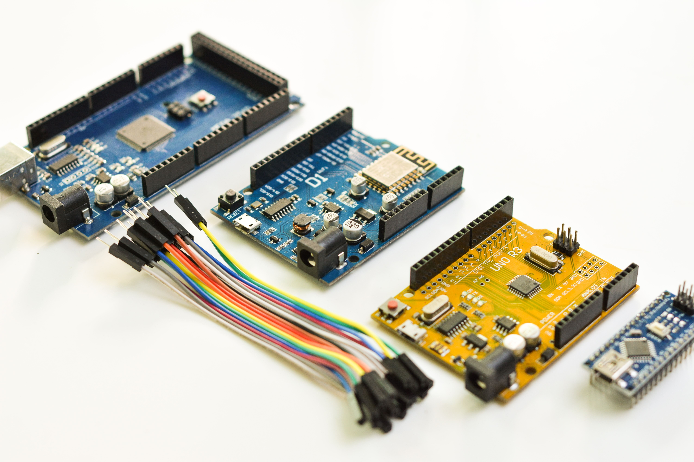

Oh well, it's been a while ain't [^1]?

I've been busy with a new job and thus getting into the swing of things with new teams, new managers, and new codebases. I really haven't had time for coding side projects let alone DIY stuff.

I am also moving in September. I don't necessarily want to get into the gritty details but I can afford a nicer place [^2] and as such I will have more space.

## Second bedroom, new lab/studio

I am taking inspiration from different nerds I admire from around the internet, especially [MacSparky Studios](https://www.macsparky.com/studio) and...

`youtube: https://youtu.be/0fs2CMvMjc8`

These guys have definitely been an inspiration, as I have a whole Notion database trying to figure out how I want my new studio to look, albeit it ain't gonna look like Jeremy's...

I think I am going to chronicle the studio setup either here, [tiffany.blog](https://tiffanywhite.blog/), or...both? I'm not sure but in any event *I'm gonna talk about it and show you whether you like it or not*. #SorryNotSorry.

[^1]: A hillbillyism from Central Pa.
[^2]: This is a hard ask; this place is *fantastic* but I want to move to a larger, loftier place with 2 bedrooms.
