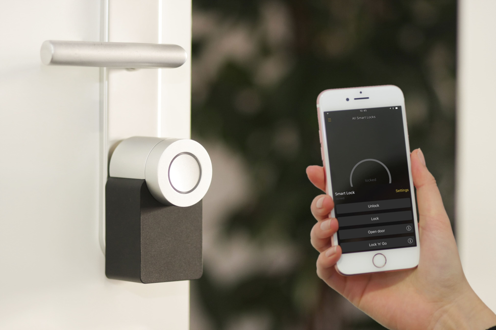

Over at my personal blog, I wrote about [going down the smart home tech rabbit hole](https://tiffanywhite.blog/2019/09/08/down-the-rabbit-hole-of-smart-home-tech/) a [couple times](https://tiffanywhite.blog/2019/08/20/collecting-surveillance-tech-but-i-dont-care/).

I have fallen hard for this stuff, and as I move, I am collecting *ever more* smart home stuff[^1].

Naturally, after watching a ton of videos on this stuff on YouTube, I created *my own* YouTube channel for this type of thing.

I am going to chronicle my moving and setting up on Vimeo for a select few people[^2] and then it's off to the YouTube races.

My channel is on YouTube at [Build & Automate](https://www.youtube.com/channel/UCWi0HlYe3si17IRc-dauGGg).

[^1]: I kinda have an issue tbh
[^2]: Micro.blog community, some of my Instagram followers on my photography account, Facebook friends of which I only have 32.
